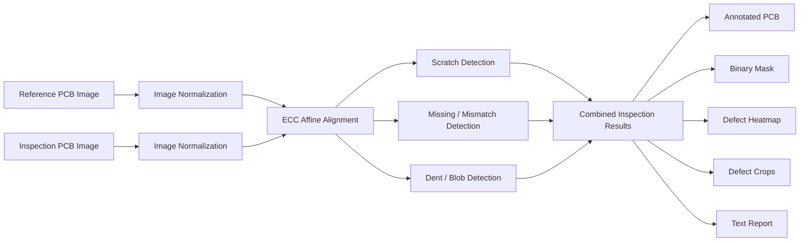
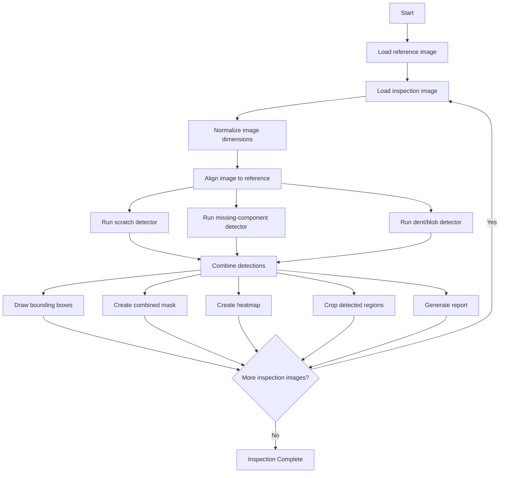

<div align="center">

# PCB LOCAL INSPECTION SYSTEM

### Reference-Based Visual Defect Inspection Using Classical Computer Vision

**A local Python inspection prototype for detecting visible PCB abnormalities through image alignment, reference comparison, and rule-based defect analysis.**

<p>
  
  
  
  
</p>

</div>

---

## 1. Project Overview

The **PCB Local Inspection System** is a Python-based computer-vision prototype developed to compare a known-good printed circuit board with one or more inspection samples.

The system is designed for local execution and does not require cloud services, model training, or an external AI API. It uses a fixed reference image, aligns each inspected PCB image to that reference, calculates visual differences, identifies suspicious regions, and generates inspection outputs for manual review.

The current prototype supports both the **front** and **back** sides of a PCB and focuses on three visible defect categories:

* Scratches
* Missing components or major visual mismatches
* Dent-like or blob-like defects

The project demonstrates the core workflow required for a reference-based automated visual inspection system.

```text
Reference PCB
     +
Inspection Image
     ↓
Image Normalization
     ↓
Reference Alignment
     ↓
Difference Analysis
     ↓
Defect Detection
     ↓
Annotated Inspection Outputs
```

---

## 2. Project Purpose

PCB manufacturing and assembly processes require consistent visual quality checks. Manual inspection can become slow and inconsistent when a large number of boards must be reviewed or when defects are small and difficult to identify.

This project was created to explore a lightweight inspection process that can:

* Compare a PCB against a known-good reference
* Detect visually changed regions
* Categorize suspicious areas using geometric rules
* Produce reusable visual evidence
* Generate text-based inspection records
* Operate fully on a local computer

The system is intended as a **prototype and engineering demonstration**. It is not currently a replacement for a certified industrial Automated Optical Inspection system.

---

## 3. Inspection Scope

### Supported Inspection Sides

The project maintains separate workflows for:

```text
Front-side PCB inspection
Back-side PCB inspection
```

Each side uses its own reference image and its own set of inspection samples.

### Supported Image Formats

The inspection pipeline accepts:

* `.jpg`
* `.jpeg`
* `.png`
* `.bmp`
* `.tif`
* `.tiff`
* `.webp`

### Maximum Processing Dimension

Images larger than the configured maximum dimension are resized while preserving their aspect ratio.

```python
MAX_DIM = 1600
```

---

## 4. Core Capabilities

### Reference-Based Comparison

The system uses the first valid image found in each reference folder as the known-good PCB image.

Every defective or inspection image is compared against this reference.

### Image Alignment

Before difference detection, the inspected PCB is aligned with the reference using OpenCV's Enhanced Correlation Coefficient method.

The alignment process uses:

* Grayscale image conversion
* Affine transformation
* ECC optimization
* Resize-only fallback when alignment fails

### Multi-Detector Inspection

Three separate rule-based detectors are executed for every PCB image:

| Detector                   | Intended defect                  | Main technique                                       |
| -------------------------- | -------------------------------- | ---------------------------------------------------- |
| Scratch detector           | Narrow line-like damage          | Difference image, Canny edges, Hough lines           |
| Missing-component detector | Large missing or changed regions | Thresholded image difference and contour analysis    |
| Dent/blob detector         | Compact irregular defects        | Morphology, contour area, and aspect-ratio filtering |

### Batch Operation

The runner processes all valid images placed in the front and back defective-image folders.

### Local Output Generation

The system generates inspection evidence without uploading files to any external service.

---

## 5. System Architecture



---

## 6. Operating Workflow



---

## 7. Detection Logic

### 7.1 Scratch Detection

The scratch detector identifies narrow and elongated changes between the reference image and the inspected PCB.

The process includes:

1. Convert both images to grayscale
2. Calculate absolute image difference
3. Apply Gaussian blur
4. Run Canny edge detection
5. Dilate edge regions
6. Detect line segments using `HoughLinesP`
7. Filter short and unsuitable line angles
8. Extract elongated contours
9. Create scratch bounding boxes

This approach is suitable for visible linear differences but may also react to edges caused by lighting or alignment changes.

---

### 7.2 Missing Component or Major Mismatch Detection

This detector focuses on large visual differences.

The process includes:

1. Convert both images to grayscale
2. Calculate absolute image difference
3. Apply Gaussian smoothing
4. Apply binary thresholding
5. Remove noise using morphological opening
6. Connect nearby regions using morphological closing
7. Extract contours
8. Filter regions using area and bounding-box dimensions

This detector may identify:

* Missing components
* Displaced components
* Major surface changes
* Large alignment differences

---

### 7.3 Dent or Blob-Like Detection

This detector identifies compact and irregular difference regions.

The process includes:

1. Calculate the grayscale difference
2. Smooth the difference image
3. Apply a lower binary threshold
4. Clean the result using morphology
5. Extract contours
6. Filter very small and very large regions
7. Remove highly elongated regions
8. Save compact suspicious areas as dent/blob candidates

---

## 8. Output Package

Each inspected image can produce five output types.

### Annotated Image

The aligned PCB image is saved with labeled bounding boxes.

| Defect type                        | Box color |
| ---------------------------------- | --------- |
| Scratch                            | Red       |
| Missing component / major mismatch | Blue      |
| Dent / blob-like defect            | Orange    |

### Binary Mask

All detector masks are combined into a single binary image.

### Heatmap

The combined defect mask is converted into a color heatmap using OpenCV's JET color map.

### Defect Crops

Each suspicious region is cropped with padding for detailed review.

### Text Report

The report contains:

* Source image name
* PCB side
* Alignment method and status
* Total number of detections
* Detection type
* Geometric score
* Bounding-box coordinates

Example:

```text
Image: pcb_front_01.png
Side: front
Alignment: {'method': 'ecc', 'ok': True}
Total defects: 3

Defect #1
  Type : scratch
  Score: 170.0
  BBox : (250, 522, 46, 12)
```

> The score represents contour area. It is not a prediction confidence value.

---

## 9. Repository Structure

```text
PCB_LOCAL_INSPECTION/
│
├── input/
│   ├── reference/
│   │   ├── front/
│   │   └── back/
│   │
│   └── defective/
│       ├── front/
│       └── back/
│
├── output/
│   ├── annotated/
│   ├── masks/
│   ├── heatmaps/
│   ├── crops/
│   └── reports/
│
├── scripts/
│   ├── config.py
│   ├── utils.py
│   ├── preprocess.py
│   ├── align.py
│   ├── detect_classical.py
│   └── run_inspection.py
│
├── requirements.txt
├── README.md
└── .gitignore
```

### Module Responsibilities

| File                  | Responsibility                                                           |
| --------------------- | ------------------------------------------------------------------------ |
| `config.py`           | Project paths, valid image formats, output locations, maximum image size |
| `utils.py`            | Folder creation, image listing, image loading, resizing, text saving     |
| `preprocess.py`       | Image normalization, grayscale conversion, board-mask helper             |
| `align.py`            | ECC affine alignment and fallback handling                               |
| `detect_classical.py` | Scratch, mismatch, and dent/blob detectors                               |
| `run_inspection.py`   | Complete front and back batch inspection workflow                        |

---

## 10. Technology Stack

| Layer                  | Technology                           |
| ---------------------- | ------------------------------------ |
| Language               | Python                               |
| Computer vision        | OpenCV                               |
| Numerical operations   | NumPy                                |
| Image utilities        | Pillow                               |
| Configuration library  | PyYAML                               |
| Progress utility       | tqdm                                 |
| Processing environment | Local machine                        |
| Detection type         | Classical rule-based computer vision |
| Trained model          | Not required                         |

---

## 11. Installation

### Prerequisites

* Python 3.x
* `pip`
* Git
* Reference and inspection images captured under similar conditions

### Clone the Repository

```bash
git clone https://github.com/Nithish-code17/PCB_LOCAL_INSPECTION.git
cd PCB_LOCAL_INSPECTION
```

### Create a Virtual Environment

#### Windows

```bash
python -m venv venv
venv\Scripts\activate
```

#### Linux or macOS

```bash
python3 -m venv venv
source venv/bin/activate
```

### Install Dependencies

```bash
pip install -r requirements.txt
```

---

## 12. Input Preparation

Place the known-good images inside:

```text
input/reference/front/
input/reference/back/
```

Place inspection samples inside:

```text
input/defective/front/
input/defective/back/
```

Example:

```text
input/
├── reference/
│   ├── front/
│   │   └── reference_front.png
│   └── back/
│       └── reference_back.png
│
└── defective/
    ├── front/
    │   ├── inspection_front_01.png
    │   └── inspection_front_02.png
    └── back/
        └── inspection_back_01.png
```

The reference and inspected images should have:

* Similar camera angle
* Similar distance
* Similar lighting
* Similar orientation
* Stable PCB placement
* Minimal reflections and shadows

---

## 13. Running the Inspection

From the project root, run:

```bash
python scripts/run_inspection.py
```

Example console output:

```text
[INFO] Processing front: inspection_front_01.png
[INFO] Processing front: inspection_front_02.png
[INFO] Processing back: inspection_back_01.png
[DONE] Inspection complete.
```

The project automatically creates the required output folders.

---

## 14. Generated File Naming

For:

```text
input/defective/front/inspection_front_01.png
```

the main outputs are:

```text
output/annotated/front_inspection_front_01_annotated.png
output/masks/front_inspection_front_01_mask.png
output/heatmaps/front_inspection_front_01_heatmap.png
output/reports/front_inspection_front_01_report.txt
```

Defect crops are stored inside:

```text
output/crops/
```

---

## 15. Recommended Inspection Conditions

For stable output:

* Mount the camera in a fixed position
* Use controlled lighting
* Keep the board orientation consistent
* Use a plain background
* Avoid reflections from solder and metal surfaces
* Use a high-quality reference PCB
* Keep the same resolution across samples
* Avoid motion blur
* Calibrate thresholds for each PCB design

---

## 16. Current Limitations

The current prototype has the following limitations:

* Detection depends on fixed thresholds.
* Lighting variation can produce false positives.
* Small alignment errors can create large difference regions.
* The same physical defect may be detected by multiple detectors.
* Detection results are not merged using non-maximum suppression.
* There is no trained classifier or segmentation model.
* There is no measured precision, recall, or accuracy score.
* The system uses the first valid reference image in each folder.
* Crop filenames can be overwritten during batch processing.
* The existing board-mask function is not applied in the main runner.
* The project has no graphical operator interface.
* The system is not calibrated for multiple PCB designs automatically.

---

## 17. Industrial Development Roadmap

To move toward a more production-oriented system:

* [ ] Introduce controlled image-capture hardware
* [ ] Add camera calibration and perspective correction
* [ ] Apply PCB-region masking before difference analysis
* [ ] Merge overlapping detections
* [ ] Add severity and defect-priority levels
* [ ] Add source-safe crop filenames
* [ ] Create CSV and PDF inspection reports
* [ ] Build a Streamlit or desktop operator interface
* [ ] Add configurable detector parameters
* [ ] Add SSIM and feature-based comparison
* [ ] Create a labeled PCB defect dataset
* [ ] Train a YOLO or segmentation model
* [ ] Measure precision, recall, false-positive rate, and processing speed
* [ ] Add pass/fail decision rules
* [ ] Integrate live camera inspection

---

## 18. Privacy and Deployment

The system processes PCB images locally.

The current implementation:

* Does not send images to a cloud API
* Does not require online model inference
* Does not require user authentication
* Stores inspection evidence on the local file system

Before industrial use, access control, audit logging, storage retention, and secure operator workflows should be added.

---

## 19. Author

<div align="center">

### Nithish Sarwin

Artificial Intelligence & Machine Learning Student
Java and Backend Developer

[GitHub](https://github.com/Nithish-code17) ·
[LinkedIn](https://linkedin.com/in/nithishsarwin) ·
[Email](mailto:mnithishsarwin@gmail.com)

</div>

---

<div align="center">

**Local visual inspection for early PCB defect-analysis research and prototyping.**

</div>
