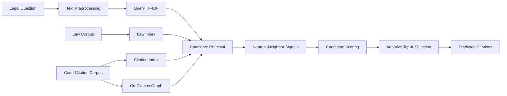
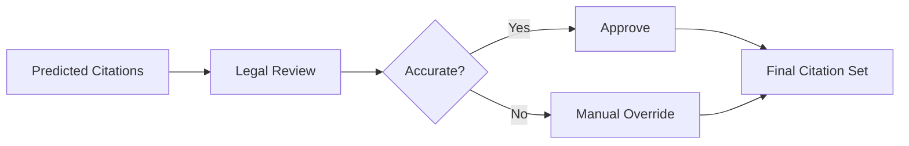

<div align="center">

# ⚖️ CITADREX

## Legal Citation Retrieval Engine

**Retrieving relevant Swiss legal provisions and court references from complex legal questions.**

<p>
  
  
  
  
</p>

<p>
  <a href="#overview">Overview</a> •
  <a href="#how-it-works">How It Works</a> •
  <a href="#experiment-results">Results</a> •
  <a href="#repository-contents">Repository</a> •
  <a href="#project-status">Status</a>
</p>

</div>

---

## Overview

**CITADREX** is an experimental legal information-retrieval system that predicts relevant legal citations for long-form legal questions.

The project works with Swiss legal material and attempts to retrieve references such as:

```text
Art. 221 Abs. 1 StPO
Art. 41 Abs. 1 OR
Art. 8 ZGB
BGE 137 IV 122 E. 6.2
1B_210/2023 E. 4.1
```

Rather than generating a legal answer, CITADREX focuses on a narrower retrieval task:

> Given a legal problem, which statutes, provisions, and court decisions are most likely to be relevant?

The system combines lexical retrieval, citation relationships, nearest-neighbor matching, ranking heuristics, and adaptive result selection.

---

## Problem Statement

Legal questions are difficult to search because they often contain:

- Long factual descriptions
- Multiple legal issues
- Formal legal language
- Procedural and substantive rules
- Statutory abbreviations
- Court citation patterns
- References that are related even when the wording is different

A standard keyword search may miss important authorities or return a large number of irrelevant matches.

CITADREX explores a structured ranking pipeline that converts a legal question into a ranked list of candidate citations.

---

## Input and Output

### Input

```csv
query_id,query
test_001,"A detailed legal question..."
```

### Output

```csv
query_id,predicted_citations
test_001,Art. 10 Abs. 2 URG;Art. 2 UWG;Art. 17 IPRG
```

Each query receives an ordered list of predicted legal authorities separated by semicolons.

---

## How It Works



### 1. Query Processing

The legal question is converted into a searchable text representation.

### 2. Law and Citation Indexing

The experiment builds separate retrieval structures for:

- Legal provisions
- Court citations
- Citation text
- Query text

### 3. TF-IDF Retrieval

TF-IDF matrices are created for both:

- Legal questions
- Law text

This provides a lightweight lexical similarity signal.

### 4. Co-Citation Analysis

A co-citation graph models legal references that frequently appear together.

This helps surface authorities that may be relevant even when they do not directly match the query wording.

### 5. Nearest-Neighbor Matching

The system compares a new query with previously labelled queries and evaluates whether their citation lists can be reused as an additional ranking signal.

### 6. Candidate Ranking

Citation candidates are combined and ranked using multiple retrieval signals and heuristics.

### 7. Adaptive Result Selection

The system compares fixed output sizes with an adaptive strategy that chooses the number of returned citations based on ranking behaviour.

---

## Experiment Scale

The committed execution log records:

| Item | Value |
|---|---:|
| Final legal corpus size | 2,161,111 |
| Validation queries | 10 |
| Test queries | 40 |
| Court-data chunks processed | 17 |
| Selected output strategy | Adaptive |

---

## Experiment Results

### Nearest-Neighbor Threshold Search

The best recorded nearest-neighbor configuration was:

```text
High threshold   : 0.80
Medium threshold : 0.60
F1@8             : 0.1667
```

### Fixed Top-K Comparison

| Top-K | Validation F1 |
|---:|---:|
| 5 | 0.1411 |
| 8 | 0.1667 |
| 10 | 0.1793 |
| 12 | 0.1802 |
| 15 | 0.1804 |
| 20 | 0.1712 |
| 25 | **0.1821** |
| 30 | 0.1739 |

### Final Strategy

| Strategy | Validation F1 |
|---|---:|
| Best fixed strategy (`k=25`) | 0.1821 |
| Adaptive strategy | **0.2012** |

The recorded run selected the **adaptive strategy** and generated predictions for all 40 test queries.

> The validation set is small, so these results should be treated as experimental rather than conclusive.

---

## Repository Contents

```text
citadrex-legal-ir/
│
├── INPUT/
│   ├── court_consideration example.txt
│   ├── laws_de.7z
│   ├── sample_submission.csv
│   ├── train.csv
│   ├── val.csv
│   └── test.csv
│
├── OUTPUT/
│   ├── candidate_long.csv
│   ├── manual_overrides_template.csv
│   ├── output.png
│   ├── review_pack.csv
│   ├── submission.csv
│   ├── submission_adaptive.csv
│   ├── submission_k5.csv
│   ├── submission_k8.csv
│   ├── submission_k10.csv
│   └── submission_k12.csv
│
├── LOG/
│   └── citadrex-t1.log
│
└── README.md
```

---

## Key Files

### Input

| File | Description |
|---|---|
| `train.csv` | Training query data |
| `val.csv` | Validation queries with gold citations |
| `test.csv` | Unlabelled test queries |
| `laws_de.7z` | Compressed German legal corpus |
| `court_consideration example.txt` | Example court citation and text format |
| `sample_submission.csv` | Required prediction format |

### Output

| File | Description |
|---|---|
| `submission.csv` | Final selected predictions |
| `submission_adaptive.csv` | Adaptive top-k predictions |
| `submission_k5.csv` | Fixed top-5 predictions |
| `submission_k8.csv` | Fixed top-8 predictions |
| `submission_k10.csv` | Fixed top-10 predictions |
| `submission_k12.csv` | Fixed top-12 predictions |
| `manual_overrides_template.csv` | Human correction template |
| `review_pack.csv` | Review artifact |
| `candidate_long.csv` | Candidate-level artifact |

### Log

`citadrex-t1.log` records:

- Dataset loading
- Corpus construction
- Co-citation graph creation
- TF-IDF index construction
- Threshold evaluation
- Fixed and adaptive top-k comparison
- Test-query scoring
- Output generation

---

## Human Review Workflow

CITADREX includes a manual override template so machine-generated predictions can be reviewed and corrected.



Example format:

```csv
query_id,query,manual_predicted_citations
test_001,"A detailed legal question...",
```

This supports a human-in-the-loop workflow rather than treating retrieval results as automatically authoritative.

---

## Project Status

The repository currently contains:

- Legal datasets
- Prediction outputs
- Validation results
- Experiment logs
- Review templates
- Documentation

The repository does **not currently include**:

- The original executable notebook
- Python source files
- `requirements.txt`
- Automated tests
- A command-line interface
- A web application
- A license

Because the executable pipeline is missing, the experiment cannot currently be reproduced directly from the repository.

---

## Reproducibility Roadmap

A future reproducible structure could use:

```text
src/
├── data_loader.py
├── preprocess.py
├── citation_parser.py
├── build_indices.py
├── rank_candidates.py
├── evaluate.py
└── export_predictions.py

notebooks/
└── citadrex_experiment.ipynb

requirements.txt
config.yaml
LICENSE
```

Suggested future command:

```bash
python -m src.rank_candidates --config config.yaml
```

This command should only be documented after the corresponding source files are added.

---

## Current Limitations

- The executable ranking code is not committed.
- Exact scoring weights cannot be verified.
- The validation set contains only 10 queries.
- TF-IDF depends strongly on shared wording.
- Multilingual legal questions may reduce lexical similarity.
- Frequent citations may receive excessive ranking weight.
- Similar queries can still involve different legal issues.
- Larger top-k values improve recall but may lower precision.
- Some output artifacts are currently empty.
- Predictions require professional legal verification.

---

## Future Improvements

- [ ] Add the complete Python pipeline
- [ ] Add dependency and environment files
- [ ] Publish the original experiment notebook
- [ ] Add BM25 retrieval
- [ ] Add multilingual sentence embeddings
- [ ] Add legal-domain reranking
- [ ] Normalize duplicate citation formats
- [ ] Expand the validation dataset
- [ ] Add MAP, MRR, recall, precision, and nDCG
- [ ] Add explainable retrieval scores
- [ ] Build an interactive review interface
- [ ] Add automated citation-format checks
- [ ] Add dataset documentation
- [ ] Add a project license

---

## Responsible Use

CITADREX is an experimental retrieval project.

It does not provide legal advice, and its predictions may:

- Be incomplete
- Contain incorrect authorities
- Miss controlling law
- Include outdated references
- Require jurisdiction-specific interpretation

Every generated citation should be verified by a qualified legal professional.

---

## Author

<div align="center">

### Nithish Sarwin

Artificial Intelligence & Machine Learning Student  
Java and Backend Developer

[GitHub](https://github.com/Nithish-code17) ·
[LinkedIn](https://linkedin.com/in/nithishsarwin) ·
[Email](mailto:mnithishsarwin@gmail.com)

</div>

---

<div align="center">

**Building transparent retrieval workflows for legal citation discovery.**

</div>
